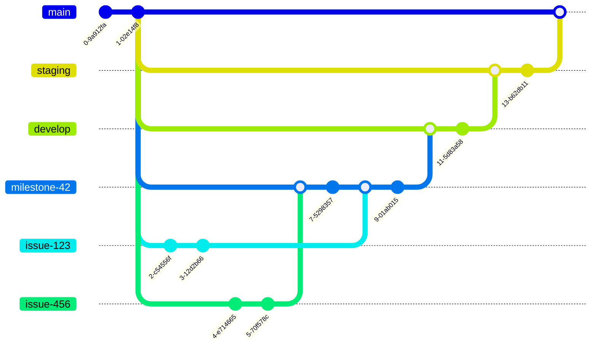

# Sumamry

This project uses Gitflow as follow:

- branch `main`: production ready code
- branch `staging`: code that can be tested as production ready
- branch `develop`: all code under development
- branch `milestone-**`: code from a scrum story
- branch `issue-**`: code for an individual task/issue

The described flow is illustrated as:



## Commit message

The commit message should be structured as follows:

```sh
<type>[optional scope]: <description>

[optional body]

[optional footer(s)]
```

## Commit types

- `build`: Changes that affect the build system or external dependencies (npm, nx)
- `ci`: Changes to CI configuration files and scripts (github actions)
- `chore`: Changes which doesn't change source code or tests e.g. changes to the build process, auxiliary tools, libraries
- `docs`: Documentation only changes
- `feat`: A new feature
- `fix`: A bug fix
- `perf`: A code change that improves performance
- `refactor`: A code change that neither fixes a bug nor adds a feature
- `revert`: Revert something
- `style`: Changes that do not affect the meaning of the code (white-space, formatting, missing semi-colons, etc)
- `test`: Adding missing tests or correcting existing tests

## Quick examples

- `feat: new feature`
- `feat[#42]: new feature`
- `feat!: breaking change` / `feat[#42]!: rework endpoint`
- `chore: update dependencies`

## Regex

The commit message will be validated with the regex:

`^(build|ci|chore|docs|feat|fix|perf|refactor|revert|style|test)(\[(#\d+)\])?[!]?: .*$`
