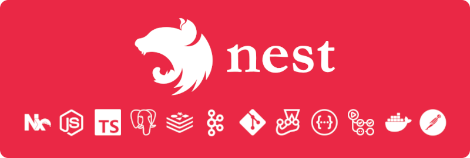

# Financial REST API with NestJS

This project implements a REST API for a financial backend with NestJS and serves as a demonstration of how to architect and develop a scalable backend API application. The project has two individual services, one to process authentication and one to process and store financial data.

## Key features

- Showcases [how to retrieve the account balance in a financial application](docs/markdown/resolved-problems/account-balance.md)
- Showcases [how to authenticate, issue and invalidate tokens](docs/markdown//resolved-problems/authentication-flow.md)
- Demonstrates [NestJS](https://docs.nestjs.com/) architecture and patterns.
- Shows how to make a secure authentication with [JWT](https://jwt.io/).
- Shows how to work with monorepo using [Nx](https://nx.dev/).
- Integrates with PostgreSQL (using [TypeORM](https://typeorm.io/)) and Redis.
- Shows how to log in JSON with [winston](https://github.com/winstonjs/winston).
- Shows how to test with [Jest](https://jestjs.io/), [Supertest](https://github.com/ladjs/supertest) and [Testcontainers](https://testcontainers.com/).
- Shows how to deploy with Docker using [multi-stage builds](https://docs.docker.com/build/building/multi-stage/)
- Shows how to [Github Actions](https://github.com/features/actions) to E2E test the application and publish the compiled code to [Docker Hub](https://hub.docker.com/).
- Shows how to use [OpenAPI/Swagger](https://www.openapis.org/) documentation for REST APIs.
- Shows how to use pre-request script in [Postman](https://www.postman.com/) to build powerfull collections.

## Technologies

- Code organization: monorepo with [Nx](https://nx.dev/)
- Backend: REST API, Node.js, [NestJS Framework](https://docs.nestjs.com/), TypeScript
- Database and cache: PostgreSQL, Redis, [TypeORM](https://typeorm.io/)
- Security: [JWT](https://jwt.io/) and [BCrypt](https://www.npmjs.com/package/bcrypt)
- Tests: Unit and integration testing ([Jest](https://jestjs.io/)), E2E Testing ([SuperTest](https://github.com/ladjs/supertest) and [Testcontainers](https://testcontainers.com/)), Code coverage ([IstanbulJS](https://istanbul.js.org/))
- CI/CD: [GitHub Actions](https://github.com/features/actions), [Docker Hub](https://hub.docker.com/u/shimisnow)
- Documentation: [OpenAPI/Swagger](https://www.openapis.org/), [Postman](https://www.postman.com/) collections, [Compodoc](https://compodoc.app/)
- Others: Docker ([with multi-stage build](https://docs.docker.com/build/building/multi-stage/)), Docker Compose, ESLint, Webpack, JWT, [winston](https://github.com/winstonjs/winston)

## Details about

- [How to run from code](docs/markdown/how-to-run.md)
- [How to deploy](docs/markdown/how-to-deploy.md)
- [Database structure and TypeORM entities](docs/markdown/database-structure.md)
- [GitHub Actions](docs/markdown/github-actions.md)
- [Documentation](docs/markdown/documentation.md)
- [Testing](docs/markdown/testing.md)
