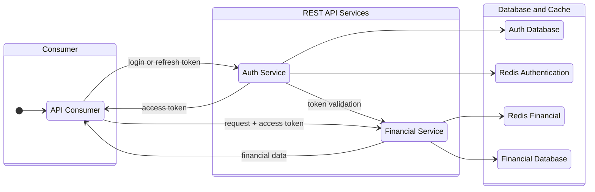

# Authentication and Financial REST API with NestJS

## Project Overview

This project is a robust REST API built using the [NestJS](https://docs.nestjs.com/) framework, designed for scalability and maintainability. Key features include a modular, testable architecture; comprehensive unit and integration testing with Jest to ensure code quality; end-to-end testing using Supertest and Testcontainers for consistent application stack testing; and an integrated CI/CD pipeline with GitHub Actions to automate testing and deployment processes.

## Key features

- Shows [how to authenticate, issue and invalidate JWT tokens](docs/markdown//resolved-problems/authentication-flow.md) using Redis cache and without storing token in database
- Shows [how to retrieve the account balance in a financial application](docs/markdown/resolved-problems/account-balance.md)
- Shows how to e2e test using [Testcontainers](https://testcontainers.com/) to create isolated environments for testing the entire application flow from the user perspective
- Shows how to make automated deployment to [Docker Hub](https://hub.docker.com/) using [multi-stage builds](https://docs.docker.com/build/building/multi-stage/) and [Github Actions](https://github.com/features/actions)

## Technology Stack

- Code organization: monorepo with [Nx](https://nx.dev/)
- Backend: REST API, Node.js, [NestJS Framework](https://docs.nestjs.com/), TypeScript
- Database and cache: PostgreSQL, Redis, [TypeORM](https://typeorm.io/)
- Security: [JWT](https://jwt.io/) and [BCrypt](https://www.npmjs.com/package/bcrypt)
- Tests: Unit and integration testing ([Jest](https://jestjs.io/)), E2E Testing ([SuperTest](https://github.com/ladjs/supertest) and [Testcontainers](https://testcontainers.com/)), Code coverage ([IstanbulJS](https://istanbul.js.org/))
- CI/CD: [GitHub Actions](https://github.com/features/actions), [Docker Hub](https://hub.docker.com/u/shimisnow)
- Documentation: [OpenAPI/Swagger](https://www.openapis.org/), [Postman](https://www.postman.com/) collections, [Compodoc](https://compodoc.app/), [Mermaid (diagram-as-code)](https://mermaid.js.org/)
- Others: Docker ([with multi-stage build](https://docs.docker.com/build/building/multi-stage/)), Docker Compose, ESLint, Webpack, [winston](https://github.com/winstonjs/winston)

## General organization

The project has two individual services:

- Auth Service: implements the authentication process with JWT tokens
- Financial Service: process and store financial data

## DevOps flow

1. Development: lint, unit and integration tests (Jest), adds a coverage report as github pull request comment
2. Staging: e2e test (Supertest) using [Testcontainers](https://testcontainers.com/) to replicate external dependencies
3. Production: build all services, create Docker images, and deploy to Docker Hub

## Documentation about

- [How to contribute](./CONTRIBUTING.md)
- [How to run from code](docs/markdown/how-to-run.md)
- [How to run with Docker](docs/markdown/how-to-deploy.md)
- [Database structure and TypeORM entities](docs/markdown/database-structure.md)
- [GitHub Actions](docs/markdown/github-actions.md)
- [Documentation](docs/markdown/documentation.md)
- [Testing](docs/markdown/testing.md)
