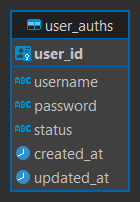
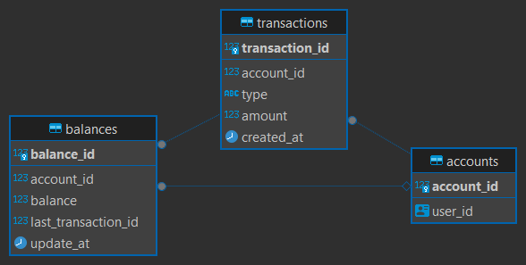

# Database structure

SQL files with database structure can be found at:

- [Authentication](../../deployment/database/authentication)
- [Financial](../../deployment/database/financial)

### Authentication database



### Financial database



## TypeORM entities

The TypeORM entities can be found at:

- [Authentication](../../apps/auth-service/src/app/database/entities/)
- [Financial](../../apps/financial-service/src/app/database/entities/)

## TypeORM migrations

```sh
npx nx typeorm:migration:create $SERVICE --name=MyMigration
# npx nx typeorm:migration:create auth-service --name=MyMigration
```

```sh
npx nx typeorm:migration:run $SERVICE
# npx nx typeorm:migration:run auth-service
```
