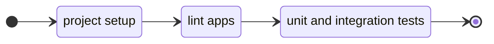
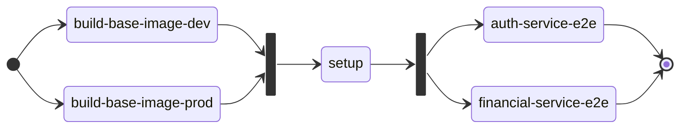
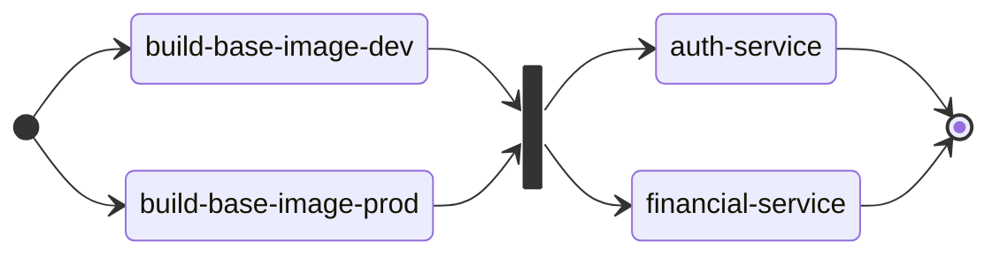

# GitHub Actions

See the [contributing guide](../../CONTRIBUTING.md) to get a diagram for the project gitflow.

### Unit and Integration testing (Jest)

Will be executed for pull request to the branches `milestone-**`, `develop`, `staging`.

- See the [workflow file](../../.github/workflows/lint-test.yml) for details.

This workflow creates the `node_modules` folder at the `project setup` step and uses it to lint and test the code for the services and shared code. At the end, generates a coverage report and adds it to a pull request comment.

### E2E Testing (Supertest and Testcontainers)

Will be executed for pull request to the branches `staging` and `main`.

- See the [workflow file](../../.github/workflows/e2e-test.yml) for details.

This workflow builds two Docker images to be used at the multi-stage build process. One at the `build-base-image-dev` step that creates an image with all npm packages (prod and dev) that are necessary to build the code. The second image is created at the `build-base-image-prod` step and has only the production dependencies. Creates the `node_modules` folder at the `setup` step and uses it to execute e2e tests for each service (`auth-service-e2e` and `financial-service-e2e` steps).

### Build Docker images and publish to Docker Hub

Will be executed when a pull request to the branch `main` is accepted.

- See the [workflow file](../../.github/workflows/deploy.yml) for details.

This workflow builds two Docker images to be used at the multi-stage build process. One at the `build-base-image-dev` step that creates an image with all npm packages (prod and dev) that are necessary to build the code. The second image is created at the `build-base-image-prod` step and has only the production dependencies.

After the creation of the base images, the final images are build at the `auth-service` and `financial-service` steps and each image is uploaded to Docker Hub.

