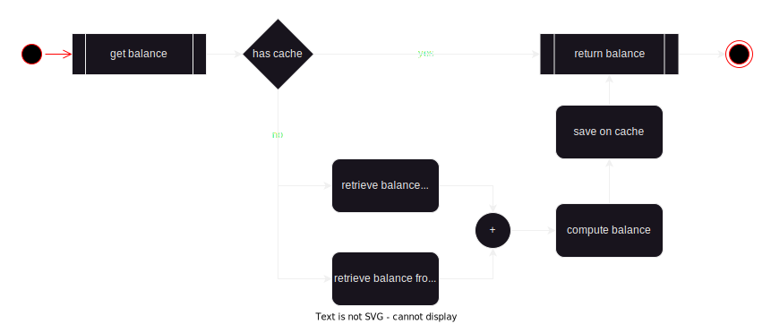

## How to retrieve the account balance in a financial application

### The problem

In an application that stores the user transactions as debit and credit operation, how can we calculate and retrieve the account balance in a efficient way.

### The Solution

#### Database

- Use of two database tables. One to store the transactions and one to store the balance.
- The balances table stores the account balance and the last transaction id that was processed to generate the balance.
- When the balance is required, the transactions with id greater than the one stored at the table is processed and the value is merged with the stored balance. The new balance is than stored at the balances table along side with the max transaction id processed.

#### Efficiency

To make the retrieve operation efficient, a cache manager is used as the following:

- When the balance is required, the cache is consulted. If there is a value, it will be returned and there is no database operation performed. If there is no value, the solution mentioned at the database section will be performed and the result will be cached.
- Every time a transaction is made, the balance cache is erased.
