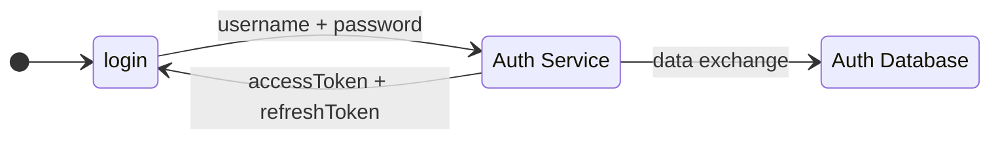
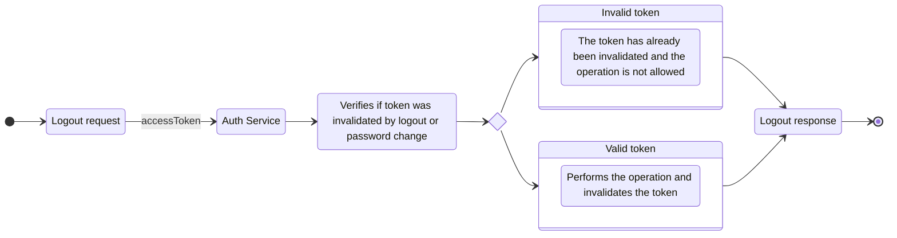
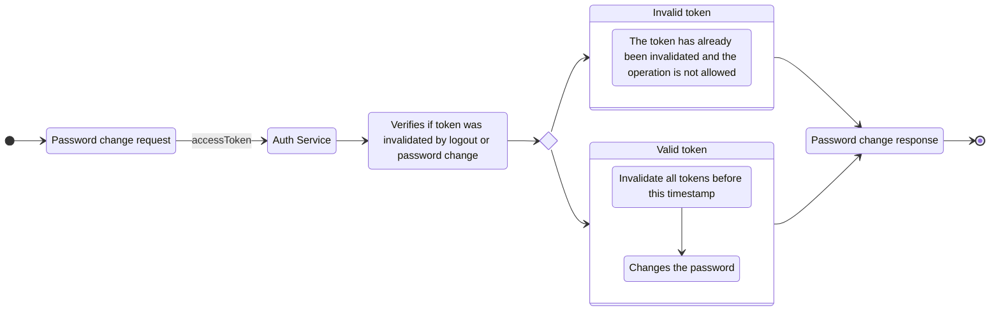
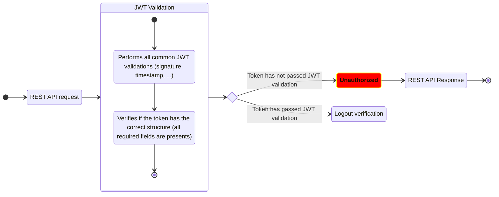
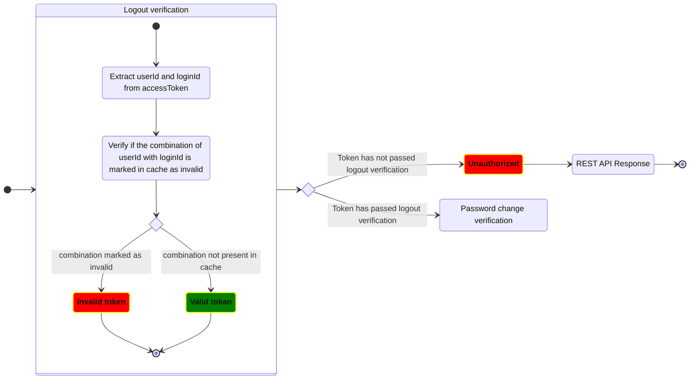
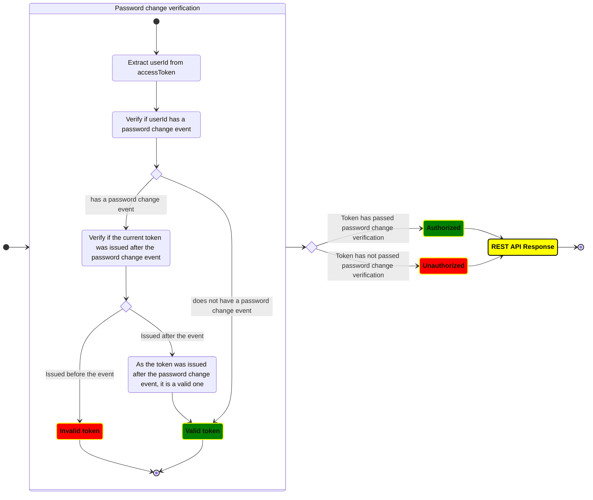

## How to authenticate, issue and invalidate tokens

## The problem

This authentication method solves the following questions:

1. How to treat login from multiple sources (server, device, browser, etc)
2. How to make a logout process from one source without logout the user from another
3. How to change the password and invalidate all issued token before the change
4. How to do all of this without a lot of database use and without add latency to the api response

All process will build up from the JWT standard

## Login

The login process is simples:

1. An API call is made with username and password
2. If the user exists, is active and the password is correct, issues an `accessToken` and `refreshToken`
3. Each token has information about `userId` and `loginId` that represents the login request

## Logout

The logout process is:

1. The endpoint requires an `accessToken`
2. The `loginId` is extracted and added to the cache to mark that the token is now invalid

Once a login request is made, all access and refresh tokens has the same `loginId`. This way a logout process invalidates all access and refresh tokens issued without the need to store each token into database

## Password change

The password change process is:

1. The endpoint requires an `accessToken`
2. The current password is required along with the new one
3. The `userId` is extracted and added to the cache to mark that the user had a password change event
4. The password change timestamp is store at cache
5. A new pair of `accessToken` and `refreshToken` is issued **AFTER** the timestamp stored at cache

With the above process, all tokens issued before the password change timestamp for this user will be invalidated

## Refresh token

The refresh token process is:

1. The endpoint requires a `refreshToken`
2. If the user is active, a new `accessToken` is issued

With the above process, a new `accessToken` can be issued without ask the user for username and password

## API calls

All secure API calls requires the `accessToken` to perform authentication within the steps:

1. Extract `userId` and `loginId` from `accessToken`
2. Verifies if `loginId` is not present at the list of performed logout
3. Verifies if `userId` is not into the cached list of password changed users. If it is, verifies if the token was issued after the password change event.
4. If all the above applies, accept the request

The algorithm is present in the following diagrams:

#### JWT validation

#### Logout verification

#### Password change verification

