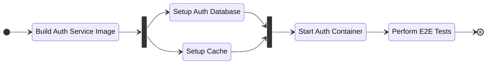
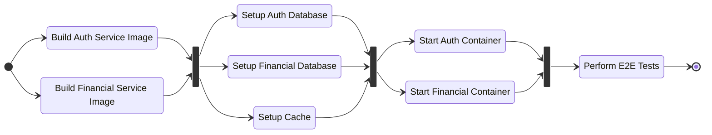

# Testing

## Unit and integration testing

The project testing is done with Jest and can be performed with the command:

```sh
npx nx test $SERVICE_NAME
```

Available service name to be replace in `$SERVICE_NAME`:

- auth-service
- financial-service

The `*.spec.ts` files can be found at `/apps/SERVICE_NAME/app/MODULE_NAME` with one file for the controller and one for the service.

To collect code coverage, use:

```sh
npx nx test $SERVICE_NAME -- --coverage
```

The results can be found at `coverage/apps/$SERVICE_NAME`.

## E2E testing

The project E2E testing is done with Jest, Supertest and [Testcontainers](https://testcontainers.com/).

Before running the tests, it is necessary to build two Docker images with the commands:

```sh
docker compose build base-image-development
docker compose build base-image-production
```

The tests require Docker, but it is not necessary to start the dependecies (database, cache). All external dependencies will be started and controlled by Testcontainers.

### Auth Service

The tests can be performed with:

```sh
npx nx e2e auth-service-e2e
```



### Financial Service

The tests can be performed with:

```sh
npx nx e2e financial-service-e2e
```

The tests for `financial-service` also used `auth-service` because the service is always necessary to validate token invalidation.


